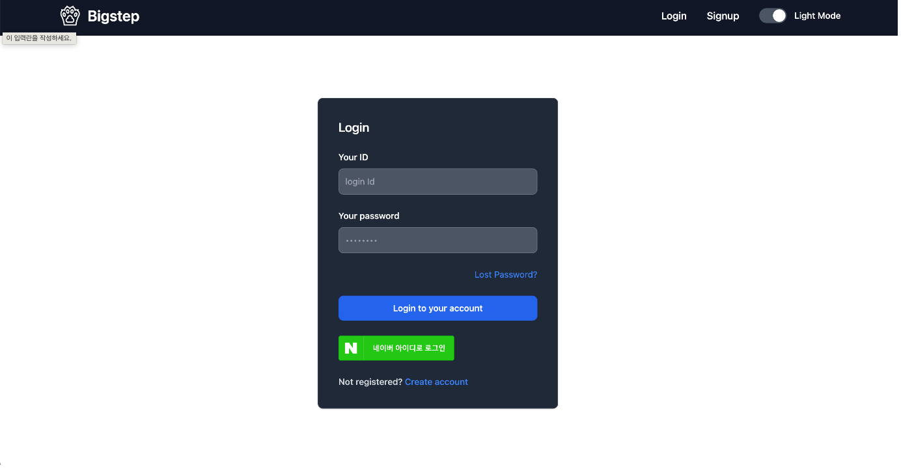
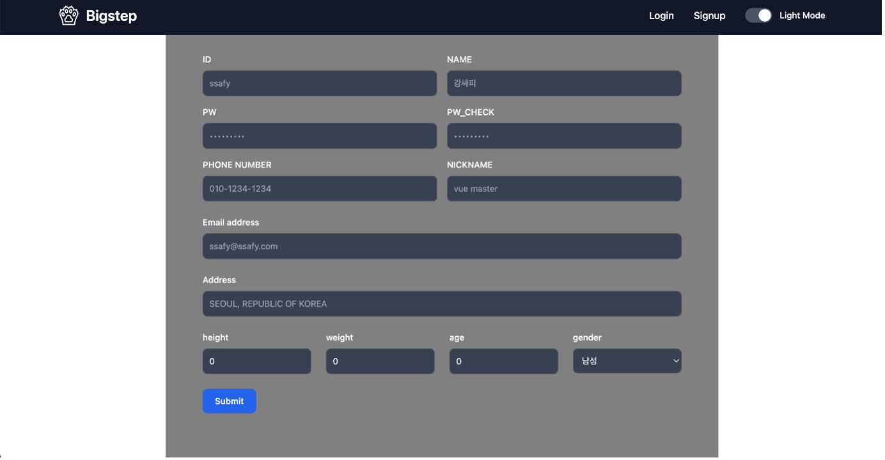
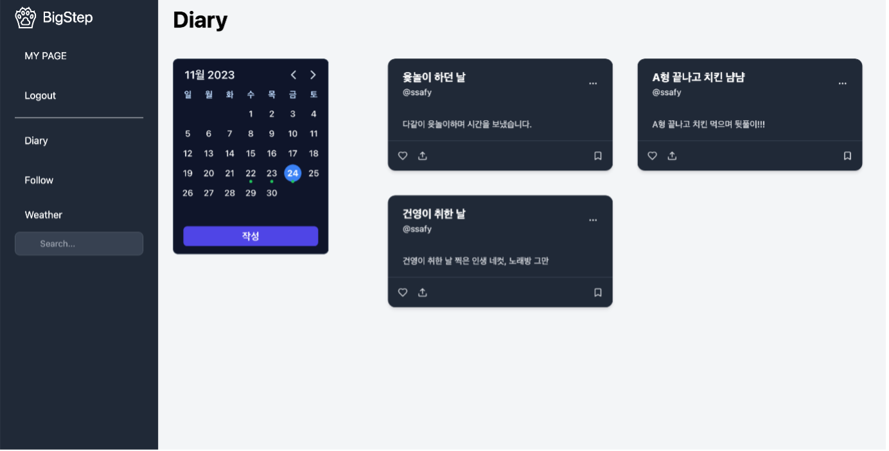
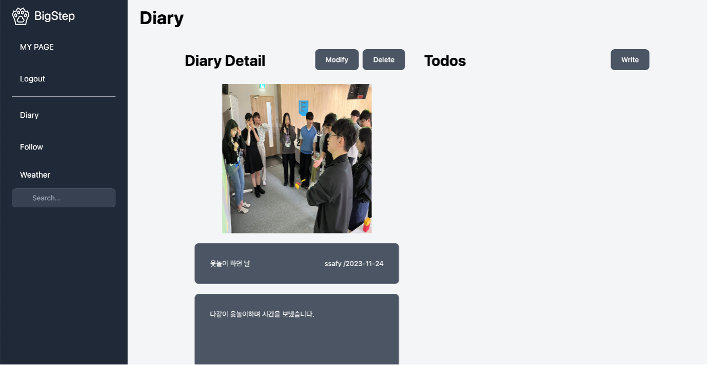
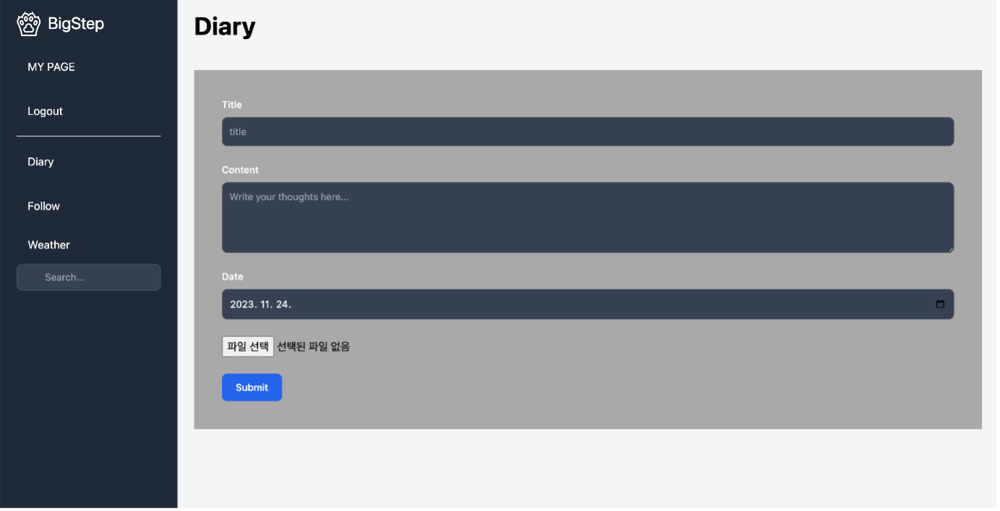
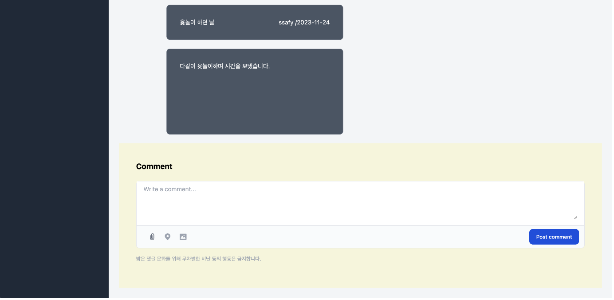
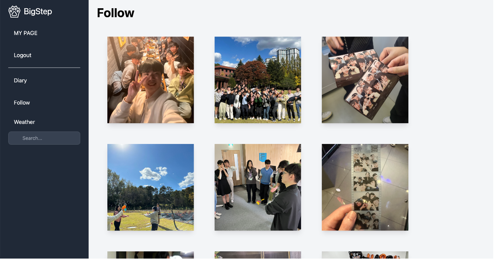
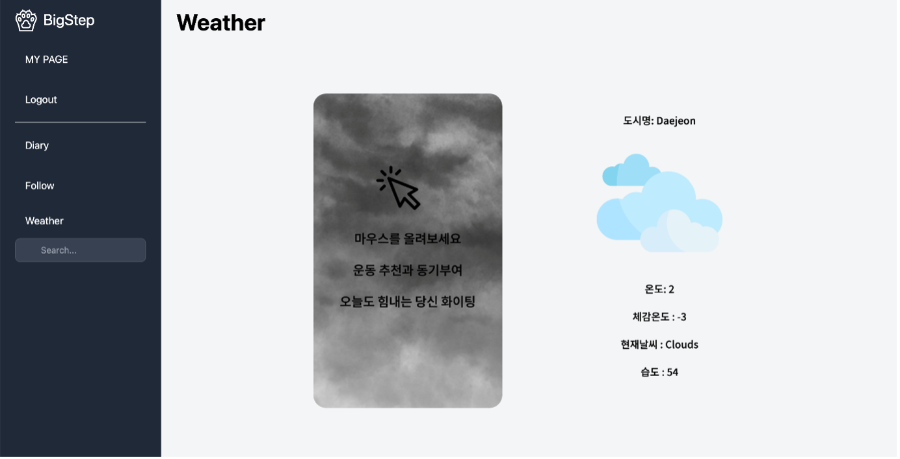
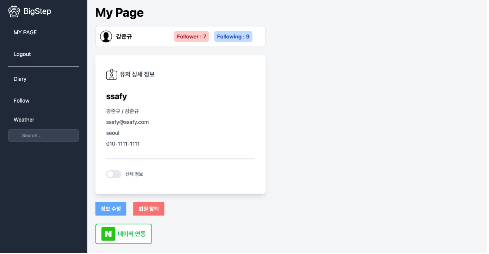
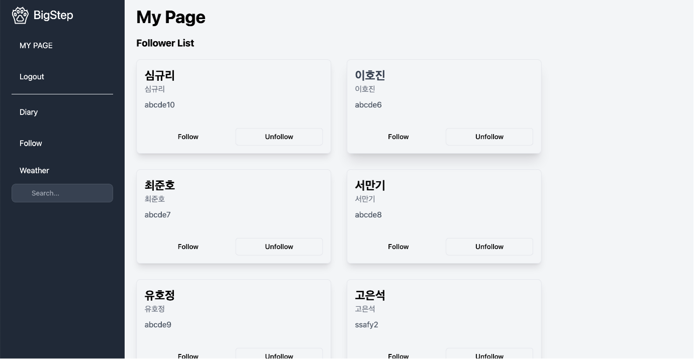

# Big Step

- 1학기 프로젝트

## 작업일자

2023.11.14 ~ 2023.11.24(2주)

## Team

- 개발자 : 강준규 / 고은석
- 역할 : 풀스택

### 사용기술

#### 백엔드

- Java, Spring, MyBatis, Maven

#### 프론트엔드

- Vue, JavaScript, Pinia, Vite, TailWind, BootStrap

1. **오늘 운동한 기록을 남기자!**

- 다이어리를 통한 운동 기록
- 사진도 함께 저장하여 다이어리 작성 가능

2. **날씨 정보 전달!**

- 해당 지역의 날씨 정보 확인 가능
- 날씨에 맞는 운동 랜덤 추천

3. **날짜를 지정하여 해당 날짜에 대한 다이어리 확인!**

- 캘린더에서 날짜를 지정하여 해당 날짜에 작성한 게시글 확인 가능

4. **todoList를 통해 오늘 할일 기록 가능**

- 쉽게 todoList를 작성하여 오늘 할일 기록

5. **팔로우 기능을 통해 타인의 다이어리 확인 가능**

- 팔로우 기능으로 타인이 작성한 게시글에 대해 확인 가능
- 공개, 비공개 설정 가능

6. **본인이 설정한 키와 몸무게 바탕으로 감량 정도 확인 가능**

- 마이페이지에서 설정한 키와 몸무게로 변화 단계 측정 가능

### 초기화면

### 로그인

### 회원가입

### 캘린터

### 다이어리 상세보기

### 다이어리 작성

### 다이어리 댓글

### 팔로잉 다이어리

### 날씨/운동추천

### 마이페이지

### 팔로우

## Notion Link

https://www.notion.so/final-project-idea-sketch-ba818f48f79f401289595b43af8df48a?pvs=4

## Swagger Link

http://localhost:7777/swagger-ui/index.html
